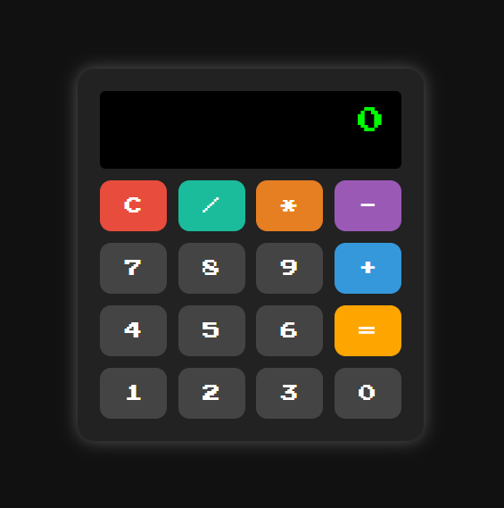

# Retro Calculator

A simple and stylish calculator built using **HTML5**, **CSS3**, and **JavaScript**. Inspired by a retro RPG aesthetic, this calculator allows you to perform basic arithmetic operations with an elegant dark theme and colorful interactive buttons.

## 🎮 Features

- Basic operations: **Addition**, **Subtraction**, **Multiplication**, **Division**
- Responsive and retro-styled UI
- Button click animations
- Dark background and pixel-style font
- Smart input behavior (blocks accidental input after results)
- Unique colors for each operator
- Clear button (`C`) with red highlight to reset operations

## 🎨 Design Highlights

- **Background**: Dark/black background for eye comfort
- **Font**: Pixel-inspired font matching RPG-style games
- **Operators**: Each operator has a distinct color for better user experience
- **Interactive**: Buttons animate when clicked for better feedback

## 🚀 How to Use

1. Clone or download the repository.
2. Open the `index.html` file in your browser.
3. Start calculating!

## 🛠 Technologies Used

- HTML5
- CSS3
- JavaScript (Vanilla)

## 📸 Preview

 

## 📄 License

This project is open source and free to use.

---
